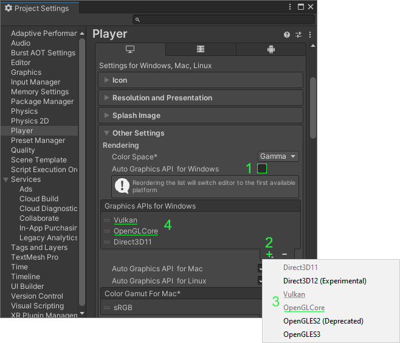
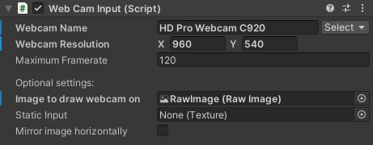
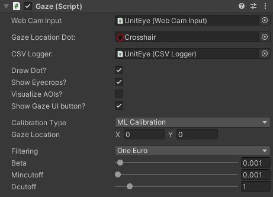
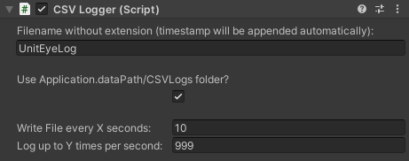
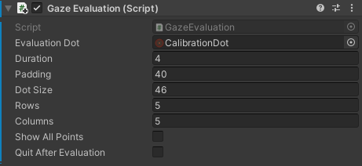

# UnitEye: Introducing a User-Friendly Plugin to Democratize Eye Tracking Technology in Unity Environments ([MuC '24]([https://muc2024.mensch-und-computer.de/en/]))

 [Tobias Wagner*]([https://scholar.google.de/citations?user=uqCJ2qsAAAAJ&hl=de&oi=ao]), [Mark Colley*](https://scholar.google.de/citations?user=Kt5I7wYAAAAJ&hl=de&oi=ao), Daniel Breckel, Michael Kösel, Enrico Rukzio (*=equal contribution)

Full paper; doi: [10.1145/3670653.3670655](https://dl.acm.org/doi/10.1145/3670653.3670655)

Webcam-based eye-tracking for Unity


## Our Features
* Easy-to-use webcam-based eye tracker for Unity projects that require no specialized hardware other than a webcam
* Filtering of the gaze location to obtain more stable results
* Calibration to make it work for your setup
* Evaluation to test the accuracy
* Area of interest system to designate areas or objects on the screen to track
* CSV logging to log all the data
* Distance to the camera, blinking, and drowsiness detection
* Built-in GUI for runtime configuration
* Easy API to get started quickly

> :warning: **Known Issues**
> * Your GPU might be incompatible with our eye tracking pipeline and Direct3D11, to fix this follow our [Graphics API Troubleshooting](#graphics-api-troubleshooting).
> * Since we use a webcam and no infrared lighting, accuracy heavily depends on the quality of your webcam and the lighting in your room. A dark room and a cheap 720p webcam will most likely not result in usable accuracy. The upside of our approach is that we are fairly resistant to glasses and contact lenses, which is an issue for infrared-based approaches.
> * The eye tracking performance degrades when you're not in the center of the webcam image. This is due to our underlying neural network from [EyeMU](https://github.com/FIGLAB/EyeMU) being very sensitive to positional changes and probably also due to optical distortion towards the edges. This can partly be mitigated by moving your head around while calibrating.
> * The current [EyeMU](https://github.com/FIGLAB/EyeMU) model is unable to generate gaze locations outside of the screen (it is, however, shifted to the bottom right for us, resulting in pseudo off-screen values). We do include an 'off-screen' AOI in our Gaze component, but it mostly doesn't do much. This is probably due to model structure and/or insufficient training.
> * The tracking in the middle of the screen can at times be inaccurate, this is probably due to insufficient training of the [EyeMU](https://github.com/FIGLAB/EyeMU) model across a wide range of setups and webcams.
> * Since this is as first version, the accuracy is not up to par with commercial infrared-based eye trackers. However, during our testing, if the room (mainly the face) is well lit through frontal lighting and the distance and position doesn't change a lot from the calibration, we've seen RMSEs of 2.5cm x and y on a 24" monitor with a distance of 60cm to the webcam (Logitech C920 running at 960x540 resolution). This equates to a visual angle of ~2.4°.
> * We use the face mesh from [HolisticBarracuda](https://github.com/creativeIKEP/HolisticBarracuda) to get the locations for our eye crops that we feed into the [EyeMU](https://github.com/FIGLAB/EyeMU) NN, HolisticBarracuda itself uses a to .onnx converted version of [Mediapipe's](https://google.github.io/mediapipe/) Holistic approach that is based on an older version. Thus, the eye crops are quite unstable which leads to a need for heavy filtering of the gaze location.
> * The current eye tracking pipeline runs blocking synchronously, meaning the frame rate of a project can only be as high as our neural network pipeline runs at. This was 40 FPS in Editor and 70 FPS in a build on a system with an i7 3820 (ancient), 16GB of DDR3 RAM (also ancient) and an AMD Vega56 GPU.
> * We've attempted to run the eye tracker on Android, however the performance was quite lackluster and Unity handles the front camera on Android in a weird way which would require us to rewrite parts of the eye tracking pipeline to handle camera rotation. This was deemed out of scope for the current project.
> * During development, we encountered a bug on one of our systems where the webcam (namely a **Logitech C920**) would only deliver around 1-2 fps when the requested resolution was set to the full 1080p. This was not reproduced on other systems and appears to be a fairly old bug in [Unity](https://answers.unity.com/questions/1426135/hd-webcam-is-slow-in-pc.html). Upgrading to newer Unity versions did not fix the bug. We suspect this is a rare bug that only happens with Logitech webcams (that do not have USB 3.0) and is out of our control.

## Used Sources and Libraries
* [Barracuda](https://docs.unity3d.com/Packages/com.unity.barracuda@2.0/manual/index.html), this is Unity's neural network inference library based around the [.onnx](https://onnx.ai/) file type
* [HolisticBarracuda](https://github.com/creativeIKEP/HolisticBarracuda) and its dependencies, our version is based on 1.1.0 and includes our required changes
* [EyeMU](https://github.com/FIGLAB/EyeMU), we use their model, converted to Barracuda (`.onnx`) by us, for our eye tracking pipeline
* [BrightWire](https://github.com/jdermody/brightwire-v2) and its compiled dependencies to easily run our deep learning-based calibration pipeline
* Other smaller code sources are referenced in code comments

## Quick Demo
The `UnitEye/` folder is a complete Unity project with our packages included. If you want to quickly look at our eye tracker, simply open that folder as a project through Unity Hub. [Getting Started](#getting-started) will walk you through the features. Use [Installation](#installation) to add our packages to an existing project. For a small demo where we use our eye tracker in a basic game, read [Gaze Game](#gaze-game)!

## Graphics API Troubleshooting
If the eye tracking isn't working at all, your GPU is most likely incompatible with our eye tracking pipeline in [Barracuda](https://docs.unity3d.com/Packages/com.unity.barracuda@2.0/manual/index.html) when using the Direct3D11 Graphics API. To fix this go through the following steps:



Open your Project Settings window (`Edit` -> `Project Settings`). Select the `Player` settings, scroll down and open the `Other Settings` for the Windows, Mac and Linux player. Untick the `Auto Graphics API for Windows` checkbox (1), add either `Vulkan` or `OpenGLCore` through the `+` menu (2 and 3) and rearrange them so they are above `Direct3D11` in the list (4). Unity will then ask you to reopen the project. Afterward, the eye tracking should be working. We recommend testing between the two alternative APIs to find the one with the better performance. This bug isn't mentioned in the Unity Barracuda [documentation](https://docs.unity3d.com/Packages/com.unity.barracuda@2.0/manual/SupportedPlatforms.html) for Windows.

## Installation
To get started with UnitEye in your project, you have to first copy `UnitEye`, `HolisticBarracuda`, and `com.github.homuler.mediapipe` from the root into your own projects `Packages/` folder.
The `HolisticBarracuda` package requires some extra dependencies, which have to be added to your project `Packages/manifest.json`.
Add the following to the `scopedRegistries` section (if it does not exist, you have to manually add the section):
```json
{
    "name": "Keijiro",
    "url": "https://registry.npmjs.com",
    "scopes": [ "jp.keijiro" ]
},
{
  "name": "creativeikep",
  "url": "https://registry.npmjs.com",
  "scopes": [ "jp.ikep" ]
}

``` 
Finally, your manifest should look something like this:
```json
{
    "scopedRegistries": [
        {
            "name": "Keijiro",
            "url": "https://registry.npmjs.com",
            "scopes": [ "jp.keijiro" ]
        },
        {
            "name": "creativeikep",
            "url": "https://registry.npmjs.com",
            "scopes": [ "jp.ikep" ]
        }
    ],
    "dependencies": {
        ...
    }
}
```

## Getting started

Once you're done with the [Installation](#installation), start up your Unity project and wait for the Package Manager to sort out the packages. After startup, you should have a window open automatically to inform you about the two newly added scoped registries. You're now ready to use UnitEye in your project! But how do you use it?

Included in the package are several example scenes, the best starting point is the `GazeScene`. Use your project browser to navigate to `UnitEye/Scenes/`. This scene includes our `UnitEye` prefab and a Canvas containing a RawImage that is stretched to cover the entire main camera. Let's have a look at the components in our prefab:

#### Web Cam Input: 
This component manages the connection between Unity and your webcam.



You can select your webcam by pressing the `Select` button, which opens a drop-down list with all the plugged-in webcams that Unity can see. Below that, you can select a desired resolution, and Unity will use the closest available resolution that your webcam can provide. The default here is 1080p. You can also set a maximum frame rate limit if you run into a bug where your webcam freezes when the application runs at several hundred frames per second.

Optional settings include a RawImage reference if you wish to have the webcam image drawn in your scene, a static input image for debugging purposes and a toggle box to mirror the image horizontally, depending on your webcam you may want to use this if you're looking at the top right corner but the webcam image is showing you looking to the top left. This mirroring is purely visual and does not influence the tracking.

#### Visualizer:
This is a component from the preexisting [HolisticBarracuda](https://github.com/creativeIKEP/HolisticBarracuda) package. We use a custom version of this package, so you shouldn't download it separately!


The main purpose of this component is to visualize all the tracking features of HolisticBarracuda, namely the face mesh, pose, and hand tracking. We currently only utilize the face mesh for our eye tracking, but you might want to use more features from HolisticBarracuda in your project! This component is disabled by default as its main purpose is debugging and will degrade the frame rate when enabled. Most settings should be left standard, but you can play around with the `Holistic Inference Type` to check out the different tracking options.

#### Gaze:
This is our main component that handles the entire eye-tracking pipeline.



The first setting is a reference to the [Web Cam Input](#web-cam-input) component you wish to use. After that you can select a texture to use as the gaze location dot, we include a simple cross-hair in our package. If you wish to use our [CSV Logger](#csv-logger), simply reference the CSV Logger component from the scene, our prefab already has one included. Below that you have 4 toggle boxes, these can be used to toggle the gaze location dot, show or hide the eye crops, toggle the visualization of our [Area Of Interest](#area-of-interest) system and show the button to toggle our runtime [Gaze UI](#gaze-ui).

Moving on, you can select between our [Calibration](#calibration) types. We currently offer `None`, which only uses the raw neural network output of the underlying [EyeMU](https://github.com/FIGLAB/EyeMU) model, `Ridge Regression`, which uses a weighted sum Ridge Regression to refine the gaze location and `ML Calibration` where we use our own machine learning multilayer perceptron that we train when calibrating. Currently, the ML calibration offers the highest accuracy and should be preferred. The current gaze location in x and y pixels coordinates (with zero at the top left corner) is displayed below the calibration type.

The last setting is the filtering selection. We currently offer a [Kalman](https://en.wikipedia.org/wiki/Kalman_filter) filter, a simple Easing filter, which is a weighted sum filter between the last and the current gaze location, combinations of those two and a [One Euro](https://gery.casiez.net/1euro/) filter. Depending on the selected filter, you can also tinker with the relevant filter values to suit your needs. We recommend the One Euro filter as it offers the best smoothing performance while being quick when larger location changes happen, but you're welcome to try out the other options.

#### CSV Logger:
This is the last component in our prefab and handles our CSV logging. If you do not wish to use the CSV Logging, simply disable this component, and nothing will be logged!



The first setting is the base filename you want to give to the .csv files we create. When you hit play in the Editor or run a built application, we automatically append the current timestamp to the filename. This is done to prevent accidental file overwriting when you have multiple runs. An example name would be `UnitEyeLog_20221021_162115.csv`, the formatting being `BaseName_YYYYMMDD_HHMMSS.csv`.

You have the choice to either use our default folder by ticking the checkbox. This equates to `/Assets/CSVLogs/` in the editor and `/ProjectName_Data/CSVLogs/` in a built application.
When you untick the checkbox, you can select your folder. Take care that this folder is accurate when using it in a build.

Our CSV Logger uses a write queue to aggregate data entries and flush them to a file every so often. The next text box is the time in seconds between queue flushes. If you only want to log our data Y times per second instead of once per frame, just specify the maximum number of entries per second in the last text box.

We log the following data in our .csv files:
* Filtered gaze location in pixel and normalized (to the screen size) values
* Unfiltered gaze location as normalized values
* Distance to the camera in millimeters
* Eye aspect ratio, can be used for drowsiness detection
* Blinking true/false
* Timestamp of the data entry in formatted time with milliseconds and Unix timestamp in milliseconds
* A list of all the areas of interest that were being looked at when the data entry was made
* Additional notes, currently used for runtime calibration and evaluation messages

#### Main Menu Button:
Our example scenes also include a main menu system to allow you to click through our scenes with ease. This component is just a simple GUI button that will load the `GazeMainMenu` scene from our project. If you wish to use this feature, you have to include all of the 5 scenes in `/Packages/UnitEye/Scenes/` in your editor build settings. However, this main menu is completely optional and not included in the prefab!

## Gaze UI
We offer a built-in GUI overlay which gives you access to some settings at runtime. When the `Show Gaze` UI button ` checkbox in a [Gaze](#gaze) component is ticked, you will see a button to toggle the GUI. When you click `Show Gaze UI` at runtime, you will see the following overlay:


This entire window is draggable with the bar at the top. You can go through all the webcams that are currently available in Unity using the `Webcam controls` section. Below that, you can `Toggle UI Overlays` similar to the Inspector settings in the [Gaze](#gaze) component. 

Moving on, you can calibrate our `Distance to camera` feature. This calibration is required when you first set up your webcam or change to a different webcam. To calibrate, simply sit so that your eyes are around 50cm away from the webcam and hit the `Calibrate Distance to Camera` button. The calibrated value in the background is saved in the PlayerPrefs of your Unity project/built app, so this calibration ideally only needs to be done once when changing webcams and persists through multiple runs.

After that, you can calibrate our `Blinking and Drowsiness` system. To calibrate the blinking threshold, close your eyes to whatever degree you want us to detect as blinking and click on the `Calibrate Blinking Threshold` button. The same applies to the drowsiness calibration. Close your eyes to the degree that you want us to detect as being drowsy and click on the `Calibrate Drowsiness Baseline` button. We then sample the eye aspect ratio of your eyes over the next 60 frames and calculate an average baseline to compare to. When your eyes are below this baseline (meaning your eyes are more shut) for a while (several seconds), we detect you as being drowsy. Both these calibrations are saved in PlayerPrefs as well.

The next section controls the used `Calibration type` and `Filtering type`. You can select between all of our currently offered calibration and filtering types and play with the relevant filter values for the current filter. The filter values are currently not being saved and will reset between runs!

Lastly, you have the option to start our `Calibration` and `Evaluation` sequence at runtime. These buttons will start a [Calibration](#calibration) or [Evaluation](#evaluation) without loading a new scene. When you start a sequence through the Gaze UI, you can cancel and return from it at any point by clicking the right mouse button.

## Calibration
Every room and computer setup needs calibration to ensure good tracking accuracy. You should also calibrate when your seating position changes drastically or when you notice a loss in accuracy (which can also be caused by a change in lighting). To do that you have two options:
* Load a new scene similar to our `UnitEye/Scenes/GazeCalibration` scene and add the `UnitEye/Scripts/Runtime/GazeCalibration.cs` component to a `UnitEye` prefab
* Do a runtime calibration through our [Gaze UI](#gaze-ui). When you do this, we load the GazeCalibration component dynamically with mostly default settings and the currently selected calibration type. You also have the option to cancel and return with right click. The calibration accuracy will be included in the .csv file if you are logging data.

When you load a new scene similar to `GazeCalibration` and add the component, you have access to the following settings in the inspector:


The Points drop-down will give you a list of all the point coordinates for the current calibration round. After that you can select a texture to use as the calibration dot, we include a default CalibrationDot with our package. The speed that the dot moves can also be changed, as well as the padding around the edges in pixels. The current Round shows the current round when calibrating.

Max Rounds Per Preset sets the maximum rounds the calibration goes through based on how many pattern presets are included. Currently, the calibration runs through the corners clockwise, then a vertical zig-zag pattern, followed by a horizontal zig-zag pattern and a counterclockwise corner pattern. When Max Rounds is set to eg. 3, it will run through those four patterns sequentially and then repeat that 2 more times, for a total of 12 rounds. We recommend 2 Max Rounds Per Preset, but you are welcome to test and change the `_presets` in `UnitEye/Scripts/Runtime/GazeCalibration.cs`.

Rounding off, you can select the Calibration Type to calibrate against (in a runtime calibration, this is the current calibration type on the Gaze component), choose whether or not to save a (and potentially overwrite an existing) calibration file, choose whether or not the calibration stops after every point (to allow your eyes to relax and you to blink if needed), and choose whether you want to quit the application after the calibration is complete.

When you start a calibration sequence either through a new scene or at runtime through [Gaze UI](#gaze-ui), you will see the following screen:


Once you left click with your mouse, the calibration will start and your task is to follow the calibration dot with your eyes. After each round, the calibration will pause, requiring you to press left click again to continue with the next round. As you can see we show ghost dots to visualize where the dot will be moving to. You can blink when the dot is stationary and between rounds, but try not to blink while the dot is moving!

When all the rounds are done, the training will start. If you want to stop the calibration early but still perform training press the `S` key. Depending on how many rounds you calibrate for and the speed you select, this can take quite a while (even several minutes on very long calibrations). Do not quit the application before the training is done with the corresponding message on the screen or the calibration file will not be saved! After the training is done we display the Root Mean Squared Error (RMSE) as a centimeter error based on your screen size. This is also included in the .csv file when you do a runtime calibration.

Speaking of calibration files, we include default files for each of our calibration types. If you start the eye tracker without a calibration of your own, we give you a warning in the console and resort to the default files. However, these can be quite inaccurate for your setup so it's best to calibrate yourself! When you finish your calibration, we save the new files in `StreamingAssets/Calibration Files/` in subfolders for each calibration type. This means that when you calibrate in the editor and then build your project into an app, the calibration files will be included!

## Evaluation
To test the accuracy of our eye tracker, we offer an evaluation sequence. The general procedure is similar to a [Calibration](#calibration), but instead of moving, the evaluation dot jumps between random points on the screen that are on a set grid. You once again have two options:
* Load a new scene similar to our `UnitEye/Scenes/GazeEvaluation` scene and add the `UnitEye/Scripts/Runtime/GazeEvaluation.cs` component to a `UnitEye` prefab
* Do a runtime evaluation through our [Gaze UI](#gaze-ui). When you do this, we load the GazeEvaluation component dynamically with mostly default settings and the currently selected calibration type. You also have the option to cancel and return with right click. The evaluation accuracy will be included in the .csv file if you log data.

When you load a new scene similar to `GazeEvaluation` and add the component, you have access to the following settings in the inspector:



First, you can select a texture to use as the evaluation dot. Then you can choose the Duration in seconds, this being the time that the dot will appear at each location. We only use data from the middle 50% of the duration (so from 25% to 75% of the duration) for the evaluation to give the user time to find the new location. Padding around the edges in pixels and the pixel size of the dot are the next settings. You can then define the number of rows and columns for our point grid. Finally, choose if you want to display the potential points on the grid as ghost dots and whether or not to quit the app after evaluating.

We evaluate all calibration types other than none at the same time, so there's no need to specify the type.

When you start an evaluation sequence either through a new scene or at runtime through [Gaze UI](#gaze-ui), you will see the following screen (the screenshot includes ghost dots to visualize the grid, this is not the default setting!):


Once you left-click with your mouse, the evaluation will start, and your task is to look at the evaluation dot. When the duration left hits 0, the dot will appear at a new random location on the grid and you should once again look at it. This will repeat until we've gone through `rows * columns` locations or until you press the `S` key to stop early. Afterward, we calculate the RMSE of each calibration type of our eye tracker and display it on the screen as a centimeter error based on your screen size. This is also included in the .csv file when you do a runtime evaluation.

## Area Of Interest
Our custom Area Of Interest (AOI) system allows you to do interesting things with our eye tracker. The [AOIManager](UnitEye/Scripts/Runtime/AOI/AOIManager.cs) class handles all the AOIs we want to track through a List<AOI>, which contains all the currently tracked AOIs. The manager includes functions to add, remove, and get AOIs from the list.  If you want to add an AOI, you have to add it to the AOIManager in the [Gaze](#gaze) component. To do so, you need to have a reference to that AOIManager, our [GazeGameAPI.cs](UnitEye/Scripts/Runtime/GazeGameAPI.cs) and [GazeGame.cs](UnitEye/Scripts/Runtime/GazeGame.cs) include several ways to do so, either through the [UnitEyeAPI](#uniteyeapi), via reference or inheritance.

We currently offer 7 different shapes for you to use as you please which will be explained in detail in this chapter. [ExampleAOIs.cs](UnitEye/Scripts/Runtime/AOI/ExampleAOIs.cs) contains examples for all of the AOI shapes.

The base class that all of our AOI shapes inherit from is [AOI.cs](UnitEye/Scripts/Runtime/AOI/AOI.cs). This class has several relevant public fields:
* ```readonly string uID``` is a unique identifier, this should be a unique string, not shared between different AOI objects and is immutable after you create a new shape
* ```bool inverted``` if this is true, the AOI shape will essentially be inverted, ie. if the shape is a simple box the AOI will be focused if the user is looking anywhere but the box
* ```bool enabled``` if this is false, the AOI will not be considered by the AOI system, almost equal to disabling a component in the Unity inspector
* ```bool visualized``` if this is false, the AOI will be excluded from the AOI visualization system
* ```bool focused``` this bool tells you if the AOI is currently being looked at (true) or not (false)

All of the AOI shapes in [UnitEye/Scripts/Runtime/AOI/Shapes/](UnitEye/Scripts/Runtime/AOI/Shapes/) include these fields, they are the main way to interact with the eye tracker. The AOI class also contains all the methods to check for point inclusion in the inheriting AOI shapes. The actual managing of the AOIs is done through the AOIManager, but this runs entirely in the background and doesn't need any setup.

> __Do note that all the following points are in normalized Vector2, `(0f,0f)` being the top left of the screen and `(1f,1f)` being the bottom right of the screen, this means they are influenced by the aspect ratio! They are almost identical to Unity's Vector2.__

We will now go through all the shapes and explain them:

#### AOIBox
[AOIBox](UnitEye/Scripts/Runtime/AOI/Shapes/AOIBox.cs) is the simplest shape, a 2D box (who would have guessed!). Relevant fields are:
* ```Vector2 startpoint``` is the startpoint of the box, usually the top left corner
* ```Vector2 endpoint``` is the endpoint of the box, usually the bottom right corner

#### AOICircle
[AOICircle](UnitEye/Scripts/Runtime/AOI/Shapes/AOICircle.cs) is a 2D circle. Relevant fields are:
* ```Vector2 center``` is the center point of the circle
* ```float radius``` is the radius in float, this is also influenced by the aspect ratio, meaning the circle might not look round unless your aspect ratio is 1:1

#### AOICapsule
[AOICapsule](UnitEye/Scripts/Runtime/AOI/Shapes/AOICapsule.cs) is a 2D capsule. Relevant fields are:
* ```Vector2 startpoint``` is the startpoint of the capsule in the middle of the shaft
* ```Vector2 endpoint``` is the endpoint of the capsule in the middle of the shaft
* ```float radius``` is the radius in float, meaning the thickness of the middle box is `2 * radius` and the semicircles on each end have a radius of `radius`

#### AOICapsuleBox
[AOICapsuleBox](UnitEye/Scripts/Runtime/AOI/Shapes/AOICapsuleBox.cs) is almost identical to an AOICapsule, the difference being that the semicircles on each end are removed, essentially creating a box that you can rotate. Relevant fields are:
* ```Vector2 startpoint``` is the startpoint of the capsule in the middle of the shaft
* ```Vector2 endpoint``` is the endpoint of the capsule in the middle of the shaft
* ```float radius``` is the radius in float, meaning the thickness of the box is `2 * radius` and the semicircles on each end have a radius of `radius`

#### AOIPolygon
[AOIPolygon](UnitEye/Scripts/Runtime/AOI/Shapes/AOIPolygon.cs) is a 2D polygon. Relevant fields are:
* ```List<Vector2> points``` is a List of Vector2 points that define the polygon, the first entry being the first corner in the polygon, the last being the last

To use this shape you have to add Vector2 points with the ```AddPoint(Vector2 point)``` or ```InsertPoint(Vector2 point, int i)``` method and can remove them either with ```RemovePoint(Vector2 point)``` or ```RemoveAllPoints(Vector2 point)```. You can also make your ```List<Vector2>``` and construct the shape with that list included. Since this list is public you can do whatever you want with it. Currently, the AOIPolygon does not allow for holes (though it might still work depending on the shape) and only allows for straight lines between the points

#### AOICombined
[AOICombined](UnitEye/Scripts/Runtime/AOI/Shapes/AOICombined.cs) is a container to combines multiple AOI shapes under one uID. Relevant fields are:
* ```private List<AOI> _aoiList``` is a List of AOIs

To use this shape you have to add AOI shapes with the ```AddAOI(AOI aoi)``` method and can remove them either with ```RemoveAOI(AOI aoi)``` or ```RemoveAOI(string uID)```. You can also make your own `List<AOI>` and construct the shape with that list included.

#### AOITagList
[AOITagList](UnitEye/Scripts/Runtime/AOI/Shapes/AOITagList.cs) is a shape that allows you to interact with GameObjects in Unity. What it does is throw a RayCast into the scene at the gaze location and return hit objects that match predefined tags from a list. Relevant fields are:
* ```private List<string> _tagList``` is a list of tag names to match against
* ```List<string> hitNameList``` contains a list of the names of GameObjects with the correct tag that was hit
* ```RaycastHit hitRaycast``` contains the currently hit RaycastHit with matching tag when using xray == false
* ```List<RaycastHit> hitRaycastList``` contains a list of all hit RaycastHit with matching tag when using xray == true
* ```Camera camera``` default is Camera.main, if you use a custom camera in your scene you might want to overwrite this
* ```int maxNumberOfRaycastHits``` the maximum number of RaycastHit, 20 being default (mostly relevant for xray RayCasts)
* ```bool xray``` if this is true, the RayCast will go through Colliders until maxNumberOfRaycastHits is reached, if false, RayCast will stop at the first hit object
* ```int layerMask``` the layer mask to use for RayCasting, see [Physics.RayCast](https://docs.unity3d.com/ScriptReference/Physics.Raycast.html)
* ```QueryTriggerInteraction queryTriggerInteraction``` specifies whether the RayCast query should hit Triggers, see [Physics.RayCast](https://docs.unity3d.com/ScriptReference/Physics.Raycast.html), the default is Ignore

To use this shape you have to add tag names with the `AddTag(string tag)` method and can remove them with `RemoveTag(string tag)`, these tags being the `Tag` of the GameObject with a collider. You can also make your own tag `List<string>` and construct the shape with that list included. Do note that this AOI depends on Unity's RayCast functionality, so your GameObject can only be detected if it has a Collider component attached.

All these shapes can be used however you like. Also the positions are not static, meaning that you can change the centerpoint of an AOICircle at runtime and that will functionally move the Circle as far as our AOI system is concerned.

For a few examples of how you can create the shapes, take a look at [ExampleAOIs.cs](UnitEye/Scripts/Runtime/AOI/ExampleAOIs.cs). Our example [Gaze Game](#gaze-game) utilizes to AOITagList to interact with GameObjects.

## UnitEyeAPI
We offer an API in [UnitEyeAPI.cs](UnitEye/Scripts/Runtime/UnitEyeAPI.cs). This API allows you to access most of the relevant fields and functions of a [Gaze](#gaze) component by calling API functions. Since this script is well-documented and most functions are very short, we invite you to take a look at the code if you intend to use it!
The API is the preferred way to access UnitEye since it is the easiest option.
__Do make sure to include `using UnitEye;` at the top of the script you want to use our UnitEyeAPI!__

## Making GameObjects Gaze Aware
One way to make GameObjects gaze-aware is by using the `AOIManager`` and a `AOITagList`. Alternatively, you can add the `Gazeable` script to a GameObject to allow it to be tracked.
Make sure to set its tag to something other than `Untagged`. Also as with the `AOITagList`, make sure your GameObject has a collider script attached.
Here is a small script highlighting how to use the `Gazeable` component:
```cs
using UnityEngine;
using UnitEye;
 
[RequireComponent(typeof(Gazeable))]
public class GazeableExample : MonoBehaviour
{
    private Gazeable _gazeable;
 
    void Start()
    {
        _gazeable = GetComponent<Gazeable>();
    }
 
    void Update()
    {
        if (_gazeable.HasGazeFocus)
        {
            // Object is being looked at 
        }
    }
}
```

## Gaze Game
This is a small demo contained in the `UnitEye/Scenes/GazeGame` scene where you can move GameObjects around by looking at them for more than 30 frames. After that, you control their location with your eyes and can "let go" of the GameObject by blinking. This is meant as a tutorial scene to show you the basics of how you can use our package.

In this scene, we've added two components to our `UnitEye` prefab that accomplish the same thing through different methods. The [GazeGameAPI.cs](UnitEye/Scripts/Runtime/GazeGameAPI.cs) utilizes our [UnitEyeAPI](#uniteyeapi) to access the AOIManager from the [Gaze](#gaze) component, while the [GazeGame.cs](UnitEye/Scripts/Runtime/GazeGame.cs) uses a simple reference to the [Gaze](#gaze) component and includes comments if you want to use inheritance instead. If you were to use inheritance, you would have to disable the Gaze component in your scene, as your new script would include all of the functionality. This does have the downside of not using our custom inspector editor, however.

## License
* HolisticBarracuda is licensed under the [Apache 2.0](https://github.com/creativeIKEP/HolisticBarracuda/blob/main/LICENSE.md) license
* BrightWire is licensed under the [MIT](https://github.com/jdermody/brightwire-v2/blob/master/LICENSE) license
* EyeMU is licensed under the [GPL 2.0](https://github.com/FIGLAB/EyeMU/blob/master/LICENSE) license
* HomulerMediaPipe is licensed under the [MIT](https://github.com/homuler/MediaPipeUnityPlugin/blob/master/LICENSE)

UnitEye itself therefore also needs the GPL License, however, we use version [3.0](/LICENSE).
