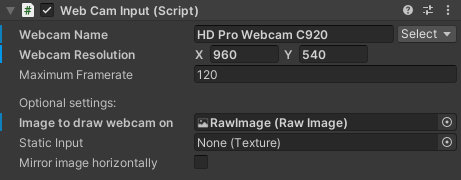
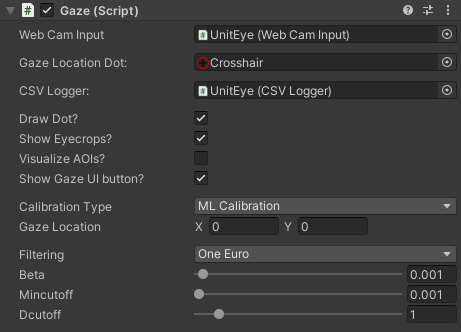
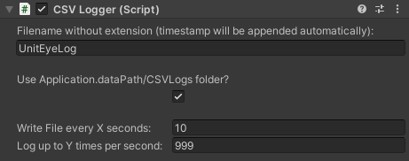
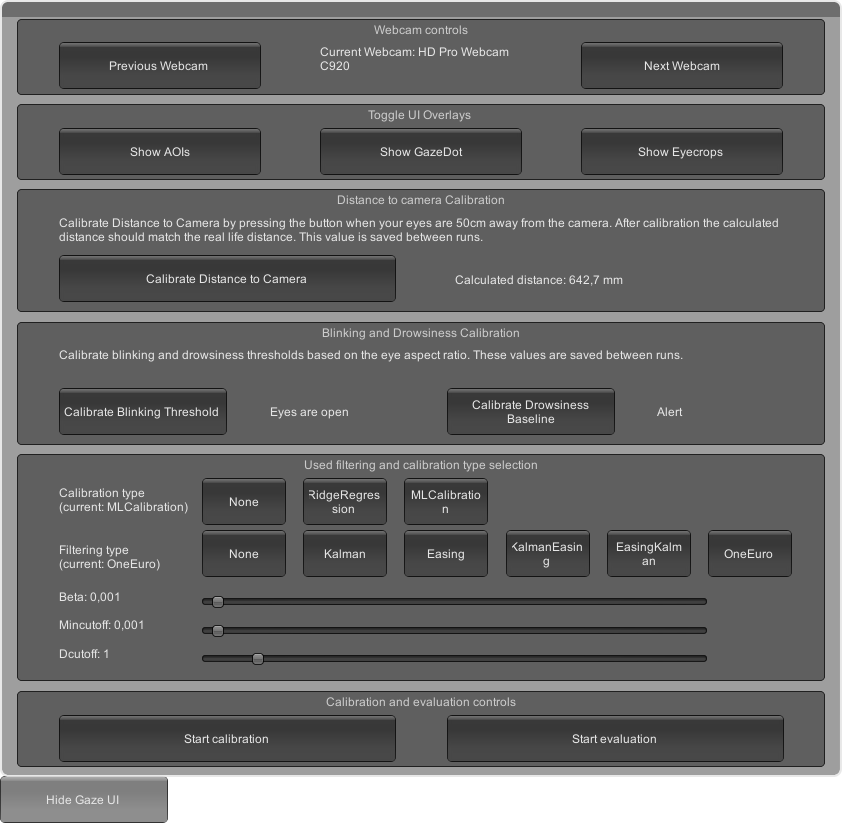
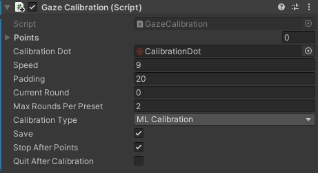
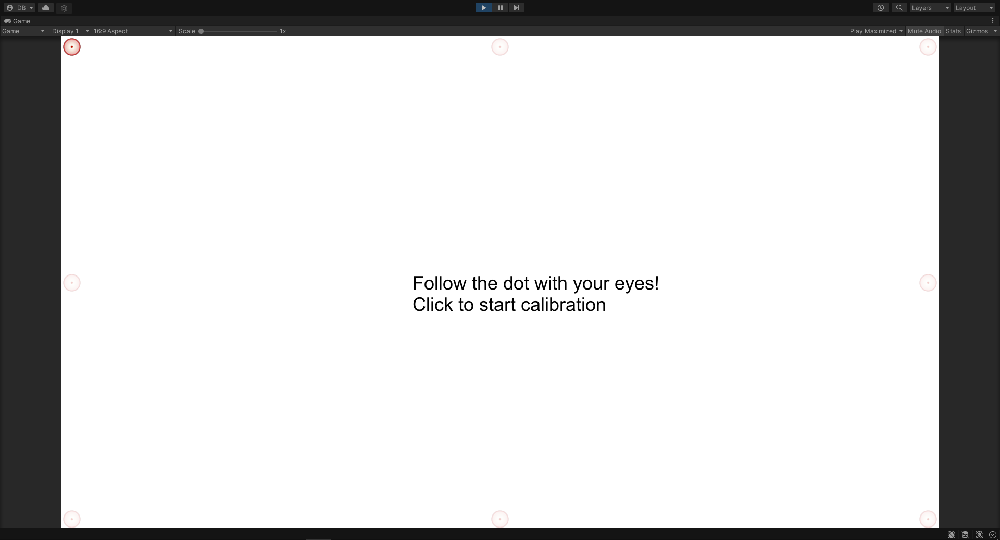
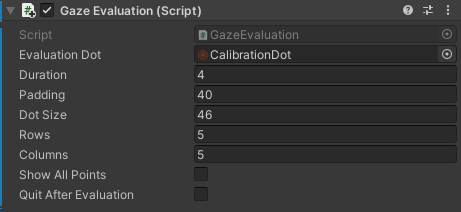
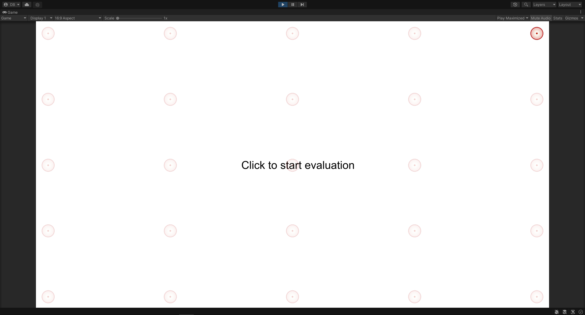
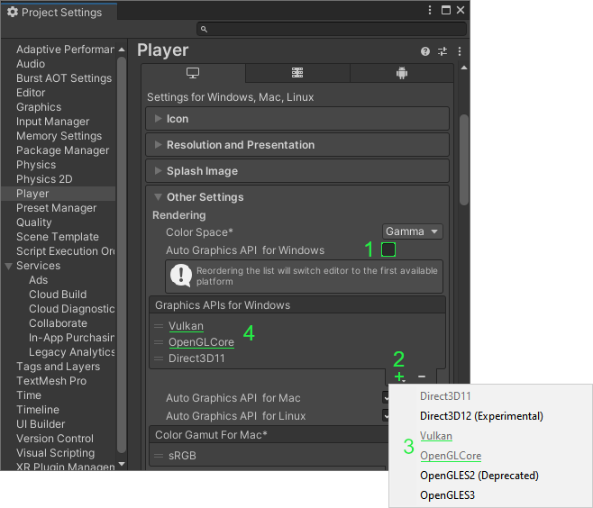

# UnitEye: Introducing a User-Friendly Plugin to Democratize Eye Tracking Technology in Unity Environments ([MuC '24](https://muc2024.mensch-und-computer.de/en/))

 [Tobias Wagner*](https://scholar.google.de/citations?user=uqCJ2qsAAAAJ&hl=de&oi=ao), [Mark Colley*](https://scholar.google.de/citations?user=Kt5I7wYAAAAJ&hl=de&oi=ao), Daniel Breckel, Michael Kösel, Enrico Rukzio (*=equal contribution)

Full paper; doi: [10.1145/3670653.3670655](https://dl.acm.org/doi/10.1145/3670653.3670655)

Webcam-based eye-tracking for Unity.

## Features
* Easy-to-use webcam-based eye tracker for Unity — no hardware other than a webcam
* **Multiple gaze models (selectable at runtime):** [EyeMU](https://github.com/FIGLAB/EyeMU) (default) or the direction-based [yakhyo/gaze-estimation](https://github.com/yakhyo/gaze-estimation) MobileOne / MobileNetV2 / ResNet-34 models — see [Gaze models](#gaze-models-backbones)
* Per-user [calibration](#calibration) (Ridge Regression or a small MLP) and an [evaluation](#evaluation) sequence to measure accuracy
* Gaze [filtering](#gaze) (Kalman, Easing, One Euro) for stable results
* An [Area-of-Interest](#area-of-interest) system to track when objects/regions are looked at
* [CSV logging](#csv-logger) of the full gaze data stream
* Distance-to-camera, blinking, and drowsiness detection
* A built-in runtime [Gaze UI](#gaze-ui) and an easy [C# API](#uniteyeapi)
* Native desktop (Windows/macOS/Linux) **and** a browser pipeline for **WebGL**

## How it works

UnitEye runs a swappable **gaze model** ("backbone") fed by Google's MediaPipe FaceMesh, then refines and consumes the result through a platform-independent stack:

```
webcam → MediaPipe FaceMesh landmarks → gaze backbone (EyeMU / MobileOne / MobileNetV2 / ResNet-34)
       → per-user calibration → filtering → AOI hit-testing → CSV logging
```

The webcam→gaze step is abstracted behind [`IGazeProvider`](uniteye/Scripts/Runtime/GazeProvider/IGazeProvider.cs) so the platform-specific computer vision can differ while everything downstream stays the same:

* **Native (desktop):** [`NativeGazeProvider`](uniteye/Scripts/Runtime/GazeProvider/NativeGazeProvider.cs) runs the native [MediaPipe Unity Plugin](https://github.com/homuler/MediaPipeUnityPlugin) (FaceMesh, 468 landmarks + iris) and the gaze model on Unity's [Inference Engine](https://docs.unity3d.com/Packages/com.unity.ai.inference@latest). The gaze model itself is a pluggable [`IGazeBackbone`](uniteye/Scripts/Runtime/GazeProvider/IGazeBackbone.cs) (EyeMU or a direction model — see [Gaze models](#gaze-models-backbones)).
* **WebGL:** the native plugin has no WebAssembly build, so the computer vision runs in the **browser** instead (getUserMedia + MediaPipe FaceLandmarker + EyeMU on onnxruntime‑web) and is bridged into Unity via [`WebGLGazeProvider`](uniteye/Scripts/Runtime/GazeProvider/WebGLGazeProvider.cs). See [`docs/WEBGL.md`](docs/WEBGL.md) and [`webgl/README.md`](webgl/README.md).

The main scene component is [`HomulerGaze`](uniteye/Scripts/Runtime/HomulerGaze.cs) on the `UnitEyeUsingHomulerMediapipe` prefab. (This replaced the old Barracuda/HolisticBarracuda `Gaze` component; see [`docs/BARRACUDA-MIGRATION.md`](docs/BARRACUDA-MIGRATION.md) for that history.)

## Gaze models (backbones)

The gaze model is selectable on `HomulerGaze` → **Gaze Backbone (model)**, or switched **at runtime** with the **Model:** button in the [Gaze UI](#gaze-ui), or via `HomulerGaze.SetBackbone(...)`:

| Backbone | Model | Notes |
|---|---|---|
| `EyeMU` (default) | [EyeMU](https://github.com/FIGLAB/EyeMU) `.onnx` | eye crops + corners + head geometry → screen point. The verified default. |
| `GazeMobileOne` | `mobileone_s0_gaze.onnx` | [yakhyo/gaze-estimation](https://github.com/yakhyo/gaze-estimation) (a.k.a. [uniface](https://github.com/yakhyo/uniface) "MobileGaze"); a face crop → gaze pitch/yaw, mapped to the screen. Fastest. |
| `GazeMobileNetV2` | `mobilenetv2_gaze.onnx` | same family. |
| `GazeResNet34` | `resnet34_gaze.onnx` | same family, largest / most accurate (uniface's default). |

Full details, the ONNX I/O, and the finish/hand-test steps are in [`docs/GAZE-BACKBONES.md`](docs/GAZE-BACKBONES.md). Three things to know:

* **Calibration is per-backbone.** Each model emits a different feature vector, so its calibration is saved and loaded under a backbone-specific filename ([`CalibrationModelStore.FileName`](uniteye/Scripts/Runtime/Calibration/CalibrationModelStore.cs)) — switching models never clobbers another's calibration, but you must **recalibrate once per model**.
* The direction models feed the network a **face** crop (not eye crops), so the Gaze UI shows a **FaceCrop** thumbnail/toggle for them instead of **Eyecrops**.
* **Every backbone emits a polynomial expansion of its raw gaze** as its calibration features so the per-axis linear calibration can reach the screen corners (the raw-gaze→flat-screen map is non-linear). EyeMU expands its normalized screen point (`gx, gy, gx², gy², gx·gy, gx³, gy³`, [`HomulerEyeMURunner.FillEyeMUFeatures`](uniteye/Scripts/Runtime/Utility/HomulerEyeMURunner.cs)); the direction models expand the gaze angles ([`GazeEstimationRunner.FillGazeFeatures`](uniteye/Scripts/Runtime/GazeProvider/GazeEstimationRunner.cs)). Without this the fit compressed predictions toward the centre ("corners bad"). See [`docs/GAZE-BACKBONES.md`](docs/GAZE-BACKBONES.md).

## Used sources and libraries
* [Unity Inference Engine](https://docs.unity3d.com/Packages/com.unity.ai.inference@latest) (`com.unity.ai.inference`, the successor to the deprecated Barracuda) — Unity's neural-network inference on [`.onnx`](https://onnx.ai/) models. UnitEye runs the gaze models on it. (Barracuda and the Inference Engine cannot coexist — both register an importer for `.onnx` — so Barracuda and the old HolisticBarracuda pipeline were removed.)
* [MediaPipe Unity Plugin](https://github.com/homuler/MediaPipeUnityPlugin) (homuler) — Google's native MediaPipe FaceMesh (468 landmarks + iris), the eye-crop / face landmark source. Uses native binaries (Windows/macOS/Linux/Android) and therefore **does not support WebGL**. Vendored at `com.github.homuler.mediapipe/` (v0.16.3, consumed through the **Task API** — `Tasks.Vision.FaceLandmarker`; the 0.12.0 → 0.16.3 migration off the removed Solution API is recorded in [`docs/HOMULER-UPGRADE.md`](docs/HOMULER-UPGRADE.md)).
* [EyeMU](https://github.com/FIGLAB/EyeMU) and [yakhyo/gaze-estimation](https://github.com/yakhyo/gaze-estimation) — the gaze models (`.onnx`).
* Unity's [Input System](https://docs.unity3d.com/Packages/com.unity.inputsystem@latest) (`com.unity.inputsystem`) and [Newtonsoft Json](https://docs.unity3d.com/Packages/com.unity.nuget.newtonsoft-json@latest) are package dependencies.
* The `ML Calibration` MLP is a small, dependency-free C# implementation ([`SimpleMLP`](uniteye/Scripts/Runtime/Calibration/SimpleMLP.cs), 12→32→16→2), replacing the former BrightWire dependency — it trains faster and, with input standardization and honest holdout evaluation, more accurately.
* Other smaller code sources are referenced in code comments.

## Quick demo
Create an empty 3D Unity project (Unity 6.3 LTS / 6000.3), follow [Installation](#installation) to add the packages, then open `HomulerGazeScene` from the UnitEye package. [Getting started](#getting-started) walks through the pieces.

## Installation
UnitEye targets **Unity 6.3 LTS (6000.3)** and is also verified on **Unity 6.5 (6000.5)** — the editor smoke suite passes on both. You need **two** package folders from the repository root: `uniteye` and `com.github.homuler.mediapipe`. Copy them into your project's `Packages/` folder (embedded packages), or reference them via `file:` in your `Packages/manifest.json`. No scoped registries are needed (HolisticBarracuda and the `jp.keijiro`/`jp.ikep` registries are gone); the remaining registry dependencies resolve from Unity's own registry:

```json
{
    "dependencies": {
        "de.uniulm.uniteye": "file:../../path/to/uniteye",
        "com.github.homuler.mediapipe": "file:../../path/to/com.github.homuler.mediapipe",
        "com.unity.ai.inference": "2.6.1",
        "com.unity.inputsystem": "1.8.2",
        "com.unity.nuget.newtonsoft-json": "3.2.1"
    }
}
```

(`uniteye`'s own [`package.json`](uniteye/package.json) declares these, so Unity resolves them automatically once the package is added; the block above is just what ends up in the manifest.)

### Required: install the MediaPipe model files
The native MediaPipe FaceMesh loads its model from your project's `StreamingAssets` at runtime and throws a `FileNotFoundException` (and produces no gaze) on desktop if it is missing. After adding the packages, run **`UnitEye ▸ Install MediaPipe StreamingAssets`** once — it copies the single self-contained Task-API bundle `face_landmarker_v2.bytes` (detector + 478-landmark model with iris) into `Assets/StreamingAssets/` ([`MediaPipeAssetInstaller`](uniteye/Scripts/Editor/MediaPipeAssetInstaller.cs); headless: `-executeMethod MediaPipeAssetInstaller.Install`). It is then included in your builds.

## Getting started

After the [Installation](#installation), open the `HomulerGazeScene` scene (navigate to `UnitEye/Scenes/` in the Project window — `UnitEye` is the package's display name). It contains the `UnitEyeUsingHomulerMediapipe` prefab with the [`HomulerGaze`](uniteye/Scripts/Runtime/HomulerGaze.cs) component (the eye-tracking pipeline) and a `Mediapipe` GameObject that runs the native face mesh. The main pieces:

#### Web Cam Input
[`WebCamInput`](uniteye/Scripts/Runtime/WebCamInput.cs) manages the connection between Unity and your webcam.



Select your webcam with the `Select` button, choose a target resolution (Unity picks the closest the webcam supports; lower is faster — see [Performance](#performance)), and optionally cap the frame rate. Optional settings include a RawImage to draw the webcam into, a static input image for debugging, and a purely-visual horizontal mirror toggle.

> The active native pipeline actually captures through the MediaPipe `WebCamSource` on the `Mediapipe` GameObject (its **Preferable Default Width** picks the capture resolution); `WebCamInput` is a lightweight helper kept for the display path.

#### Face-mesh visualization (debug)
The old HolisticBarracuda `Visualizer` (face/pose/hand) was removed with the rest of the Holistic path — the pipeline now tracks only the face mesh used for the crops. The **Gaze UI → Show/Hide FaceMesh** button (also `HomulerGaze.showFaceMesh` / `IGazeProvider.AnnotateFaceMesh`) draws a debug preview: [`FaceMeshSolution`](uniteye/Scripts/Runtime/Mediapipe/FaceMeshSolution.cs) renders the live webcam full-screen in IMGUI with the 478 face-landmark points overlaid. The camera shows whenever the pipeline is rendering (it hides during calibration); the landmark dots additionally require the toggle. It's a points-only overlay (not the old connective mesh); if the view is upside-down or mirrored on your webcam, flip the serialized **Preview Flip Vertically** / **Preview Mirror** knobs on the `Mediapipe` GameObject's `FaceMeshSolution`. For a single landmark's world position, [`LandmarkVisualizer.cs`](uniteye/Scripts/Runtime/LandmarkVisualizer.cs) is a minimal example to extend.

#### Gaze
[`HomulerGaze`](uniteye/Scripts/Runtime/HomulerGaze.cs) drives the whole pipeline.



Top settings are a reference to the `Mediapipe` GameObject (the native face mesh), the calibration script, the **Gaze Backbone (model)** ([Gaze models](#gaze-models-backbones)), a texture for the gaze dot (a crosshair is included), and an optional [CSV Logger](#csv-logger) reference (the prefab includes one). Four toggle boxes control the gaze dot, the eye crops, the [AOI](#area-of-interest) visualization, and the [Gaze UI](#gaze-ui) toggle button.

Below that you pick the [Calibration](#calibration) type — `None` (raw model output), `Ridge Regression` (the default/recommended: deterministic, standardized features, cross-validated regularization, honest held-out RMSE), or `ML Calibration` (the dependency-free MLP; can beat ridge on nonlinear mappings at the cost of non-determinism and a few seconds of training). The current gaze location (x/y pixels, origin top-left) is shown below it. Then the filtering selection: a [Kalman](https://en.wikipedia.org/wiki/Kalman_filter) filter, an Easing filter, their combinations, and a [One Euro](https://gery.casiez.net/1euro/) filter (recommended); each exposes its own tunable values.

Finally, `HomulerGaze` holds the last gaze location while you blink (`Hold Gaze During Blink`), since eye crops during a blink are unreliable; the hold is capped by `Max Blink Hold Seconds` (default 0.5 s) so a bad blink threshold can't freeze the gaze.

#### CSV Logger
[`CSVLogger`](uniteye/Scripts/Runtime/CSV/CSVLogger.cs) handles logging (disable the component to log nothing).



Set a base filename; the current timestamp is appended automatically (`BaseName_YYYYMMDD_HHMMSS.csv`) to avoid overwrites. Use the default folder (`Assets/CSVLogs/` in the editor, `ProjectName_Data/CSVLogs/` in a build) or pick your own. A write queue flushes to disk every *X* seconds; you can also cap logging to *Y* entries per second instead of once per frame. Logged columns:
* Filtered gaze location, in pixels and normalized to the screen
* Unfiltered gaze location, normalized
* Distance to the camera (mm)
* Eye aspect ratio (for drowsiness), and blinking true/false
* Formatted timestamp with milliseconds, and Unix timestamp (ms)
* The AOIs being looked at when the entry was made
* Additional notes (used for runtime calibration/evaluation messages)

## Gaze UI
A built-in runtime overlay for tweaking settings without leaving play mode. Enable the `Show Gaze UI` toggle on the [Gaze](#gaze) component to get the on-screen toggle button.



The window is draggable by its top bar. **Webcam & Model controls** cycle through available webcams (`Prev Cam` / `Next Cam`) and switch the gaze model live (`Model:` button — cycles EyeMU → MobileOne → MobileNetV2 → ResNet34; gaze falls back to raw until you recalibrate the new model). **Toggle UI Overlays** mirrors the inspector toggles plus a **FaceMesh** overlay toggle. Below that: `Distance to camera` calibration (sit ~50 cm away and click; saved to PlayerPrefs), `Blinking and Drowsiness` calibration (also PlayerPrefs), the runtime `Calibration type` / `Filtering type` selectors and filter sliders (slider values are not persisted), and buttons to start a [Calibration](#calibration) or [Evaluation](#evaluation) without loading a scene (right-click cancels).

> **Blurry Gaze UI text in the editor on a high-DPI display?** The overlay uses IMGUI, which renders at the Game view resolution and is scaled up, so text can look soft on a high-DPI screen while editor chrome stays sharp. In the Game view, set **Free Aspect** and enable **"Low Resolution Aspect Ratios"** for crisp text; a standalone build is crisp regardless.

## Calibration
Every setup needs calibration for good accuracy; recalibrate if your seating or lighting changes. Two ways:
* Open a scene like `UnitEye/Scenes/HomulerGazeCalibration` and add the [`HomulerGazeCalibration`](uniteye/Scripts/Runtime/HomulerGazeCalibration.cs) component next to `HomulerGaze`, **or**
* Run a runtime calibration from the [Gaze UI](#gaze-ui) (loads the component dynamically with the current calibration type; right-click cancels; the accuracy is written to the CSV if logging).



Inspector settings include the calibration dot texture (a default `CalibrationDot` is included), dot speed, edge padding, and `Max Rounds Per Preset`. The active presets ([`HomulerGazeCalibration.cs`](uniteye/Scripts/Runtime/HomulerGazeCalibration.cs)) begin with a repeated **corner** pass: it dwells at the four corners and edge midpoints, rejects unstable or under-sampled fixation frames, and balances target cells before training so dense sweeps cannot outweigh the screen extremes. A **head-movement** stage ([`HeadRotationPreset`](uniteye/Scripts/Runtime/Calibration/HeadRotationPreset.cs)) follows: the dot dwells at the centre and corners while an on-screen banner prompts you to **slowly turn your head**. Head yaw/pitch/roll are model features, but a sit-still calibration captures them at one pose (near-zero variance, so the fit ignores them); capturing the same target across head poses gives them leverage so the calibration can compensate for head movement during use. **Head Rotation Dwell Seconds** controls how long each of those dwells lasts. The **Normalized Safe Margin** keeps targets away from the physical bezel (default 8% on each axis); increase it if the outermost targets remain unreliable. **Corner Visits**, **Corner Dwell Seconds**, and **Settle Seconds** control corner sample quality. Zig-zag, vertical-wavy, and horizontal-wavy sweeps follow for full-screen coverage; with `Max Rounds Per Preset = 2` that's 10 rounds. You also choose the calibration type, whether to save (overwriting an existing file for that type+model), and whether to quit after calibrating.

**Feature Augmentation** is the default calibration approach (**enabled by default**). It adds deterministic, bounded zero-mean jitter to the numerical gaze-model features during fitting only; its scale is derived from each training feature's standard deviation. On top of that it adds a small **head-pose jitter** (**Head Pose Jitter Degrees**, default 3°) to the head yaw/pitch/roll features specifically, modeling head-pose measurement noise so the fit does not overcommit to the exact calibration head pose — this complements the head-movement stage above. Augmentation preserves target labels and never touches held-out RMSE or evaluation samples. Do not use image flips, crops, or rotations here: calibration learns from feature vectors and those transformations do not preserve a screen-target label. To measure its effect, disable it and compare against the independent [evaluation](#evaluation) sequence — especially its corner and edge RMSE.



Left-click to start, then follow the dot with your eyes; it pauses between rounds for another click. The dot **pulses with an expanding ring while it is collecting** a fixation, so it is obvious when to hold your gaze steady (the [evaluation](#evaluation) dot pulses the same way), and during the head-movement stage a banner prompts you to turn your head. Frames without a detected face (or before the webcam has delivered a fresh image) are excluded from the training data automatically, so repeated render frames cannot overweight one camera image. Invalid eye crops are also rejected rather than reusing a prior crop. Press `S` to stop early but still train. Don't quit before training finishes (or the file isn't saved). The Root-Mean-Squared Error (in cm for your screen) is shown afterward and written to the CSV for runtime calibrations.

For **Ridge Regression** the reported RMSE is measured on a randomly held-out 20 % of samples, with the regularization strength chosen by 5-fold cross-validation on the training portion — an honest estimate that can read slightly higher than older UnitEye versions.

**No default calibration is shipped:** calibration is per-person (an old one-person default extrapolated off-screen for everyone else and stuck the dot in a corner). Before you calibrate, UnitEye logs a one-time warning and uses the **raw, uncalibrated** gaze — it tracks roughly and stays on-screen but isn't accurate. Finished calibrations are saved under `StreamingAssets/Calibration Files/`, in a subfolder per calibration type and under a **per-backbone filename** (so each model keeps its own), and are therefore included in builds. Tip: set the calibration type to `None` to view the raw gaze while sanity-checking tracking.

### Calibration profiles (save/load)
Because calibrating well takes a while, the [Gaze UI](#gaze-ui) has a **Calibration profiles** panel that saves the current calibration (for the active backbone) under a name and restores it later — so you can keep a good calibration, switch between people/setups, or share one. Each profile is a single self-contained JSON file ([`CalibrationProfileStore`](uniteye/Scripts/Runtime/Calibration/CalibrationProfileStore.cs)). **Save** writes to `StreamingAssets/Calibration Files/Profiles/<name>.json`; **Load** (browse with `<` / `>`) restores the files and reloads the model live. Profiles committed to the repo live in the package under `Resources/CalibrationProfiles/` and are listed alongside your local ones — for example the bundled **MC-14-07-2026** EyeMU RidgeRegression profile. A profile only makes sense with the backbone and feature layout it was made for; if the gaze model's feature vector changes, re-save it.

## Evaluation
To measure accuracy, run an evaluation: like a calibration, but the dot jumps between random points on a grid. Add the [`HomulerGazeEvaluation`](uniteye/Scripts/Runtime/HomulerGazeEvaluation.cs) component next to `HomulerGaze`, or start one from the [Gaze UI](#gaze-ui).



Settings: the evaluation dot texture, the per-location `Duration` (only the middle 50 % of each is used, giving you time to find the new point), edge padding, **Normalized Safe Margin**, dot size, grid rows/columns, whether to show the grid as ghost dots, and whether to quit afterward. All calibration types (except `None`) are evaluated at once. Results report overall plus corner, edge, and center RMSE separately, so verify corner performance rather than relying on an average dominated by center targets. When both models exist, evaluation identifies the lower-corner-error model and can apply it automatically with **Apply Best Corner Model**.



Left-click to start and look at each dot until it moves; press `S` to stop early. Every grid target is sampled, using only fresh camera frames. The reported per-axis RMSE (cm) uses the same plain metric as calibration holdout evaluation and is independent of the visual dot size.

When it finishes, an **accuracy heatmap** overlays the screen (toggle **Show Heatmap**): each grid target gets a line to the **mean measured gaze**, colored green/amber/red by error, so you can see *where* tracking is good or off rather than reading a single average — handy for deciding whether a region needs re-calibration.

## Area Of Interest
The AOI system tracks when regions/objects are looked at. [`AOIManager`](uniteye/Scripts/Runtime/AOI/AOIManager.cs) holds the tracked AOIs and offers add/remove/get; add AOIs via the [UnitEyeAPI](#uniteyeapi), by reference, or by inheritance (see [`GazeGameAPI.cs`](uniteye/Scripts/Runtime/GazeGameAPI.cs) / [`GazeGame.cs`](uniteye/Scripts/Runtime/GazeGame.cs)). [`ExampleAOIs.cs`](uniteye/Scripts/Runtime/AOI/ExampleAOIs.cs) shows every shape.

All shapes inherit [`AOI.cs`](uniteye/Scripts/Runtime/AOI/AOI.cs), which exposes `readonly string uID` (unique id), `bool inverted` (invert the region), `bool enabled`, `bool visualized`, and `bool focused` (currently looked at). Shapes live in [`AOI/Shapes/`](uniteye/Scripts/Runtime/AOI/Shapes/).

> All AOI coordinates are normalized `Vector2`, `(0,0)` top-left and `(1,1)` bottom-right — so they are influenced by the aspect ratio.

The 7 shapes:

* **[AOIBox](uniteye/Scripts/Runtime/AOI/Shapes/AOIBox.cs)** — a 2D box: `Vector2 startpoint`, `Vector2 endpoint`.
* **[AOICircle](uniteye/Scripts/Runtime/AOI/Shapes/AOICircle.cs)** — `Vector2 center`, `float radius` (aspect-influenced, so it looks round only at 1:1).
* **[AOICapsule](uniteye/Scripts/Runtime/AOI/Shapes/AOICapsule.cs)** — `Vector2 startpoint`, `Vector2 endpoint`, `float radius` (a box of thickness `2*radius` with semicircular caps).
* **[AOICapsuleBox](uniteye/Scripts/Runtime/AOI/Shapes/AOICapsuleBox.cs)** — a capsule without the semicircle caps (a rotatable box).
* **[AOIPolygon](uniteye/Scripts/Runtime/AOI/Shapes/AOIPolygon.cs)** — `List<Vector2> points`; add/remove with `AddPoint`/`InsertPoint`/`RemovePoint`/`RemoveAllPoints`. No holes; straight edges only.
* **[AOICombined](uniteye/Scripts/Runtime/AOI/Shapes/AOICombined.cs)** — groups multiple AOIs under one `uID`; `AddAOI`/`RemoveAOI`.
* **[AOITagList](uniteye/Scripts/Runtime/AOI/Shapes/AOITagList.cs)** — raycasts into the scene at the gaze point and reports GameObjects whose `Tag` matches a list (`AddTag`/`RemoveTag`). Requires a Collider on the target. Fields include `hitNameList`, `hitRaycast`/`hitRaycastList`, `Camera camera` (default `Camera.main`), `maxNumberOfRaycastHits` (20), `bool xray`, `int layerMask`, and `QueryTriggerInteraction`.

AOI positions are not static — moving e.g. an `AOICircle.center` at runtime moves the region. The [Gaze Game](#gaze-game) uses `AOITagList` to interact with GameObjects.

## UnitEyeAPI
[`UnitEyeAPI.cs`](uniteye/Scripts/Runtime/UnitEyeAPI.cs) is the easiest entry point — short, well-documented static methods over a [`HomulerGaze`](uniteye/Scripts/Runtime/HomulerGaze.cs) in the scene. Add `using UnitEye;` at the top of your script.

## Coarse gaze targets: GazeGridQuantizer
Webcam gaze is jittery. For coarse regions ("which third of the screen"), use [`GazeGridQuantizer`](uniteye/Scripts/Runtime/Utility/GazeGridQuantizer.cs): it snaps the gaze to a grid and only switches cells after the gaze has clearly (hysteresis) and steadily (dwell time) settled elsewhere, so cells don't flicker at borders.

```cs
using UnitEye;
using UnityEngine;

public class CoarseGazeExample : MonoBehaviour
{
    private GazeGridQuantizer _quantizer = new GazeGridQuantizer(columns: 3, rows: 3);

    void Update()
    {
        var gaze = UnitEyeAPI.GetGazeLocationInGUI();
        var normalized = new Vector2(gaze.x / Screen.width, gaze.y / Screen.height);

        if (_quantizer.Update(normalized, Time.unscaledTime))
            Debug.Log($"Now looking at cell {_quantizer.CurrentColumn}, {_quantizer.CurrentRow}");
    }
}
```

The hysteresis margin and dwell time are constructor parameters (defaults 0.15 cells / 0.1 s) — increase for more stability, decrease for faster reactions.

## Making GameObjects gaze-aware
Besides `AOIManager` + `AOITagList`, add the [`Gazeable`](uniteye/Scripts/Runtime/Gazeable.cs) component to a GameObject. Give it a tag other than `Untagged` and a Collider.

```cs
using UnityEngine;
using UnitEye;

[RequireComponent(typeof(Gazeable))]
public class GazeableExample : MonoBehaviour
{
    private Gazeable _gazeable;

    void Start() => _gazeable = GetComponent<Gazeable>();

    void Update()
    {
        if (_gazeable.HasGazeFocus)
        {
            // Object is being looked at
        }
    }
}
```

## Gaze Game
A small demo: look at a GameObject for >30 frames to pick it up, blink to let go. [`GazeGame.cs`](uniteye/Scripts/Runtime/GazeGame.cs) does this via a reference to the gaze component, [`GazeGameAPI.cs`](uniteye/Scripts/Runtime/GazeGameAPI.cs) via the [UnitEyeAPI](#uniteyeapi).

> The standalone `GazeGame` demo scene was removed with the other HolisticBarracuda-era scenes; to try it, add a tagged, collidered GameObject and `GazeGame` to a copy of `HomulerGazeScene`.

## Performance
The pipeline runs the FaceMesh graph + gaze inference synchronously, so project frame rate is bounded by how fast that runs. [`docs/PERFORMANCE.md`](docs/PERFORMANCE.md) lists the tuning levers — lower the webcam capture resolution, turn off the face-mesh overlay, drop the iris/attention model if you don't need distance/drowsiness, and (advanced) the async-readback and running-mode options.

## Known issues
* Accuracy depends on webcam quality and lighting — a dark room + a cheap 720p webcam won't give usable accuracy. Upside: fairly robust to glasses/contacts (unlike infrared).
* Tracking degrades away from the center of the webcam image (the EyeMU model is sensitive to position + optical distortion at the edges); mitigate by moving your head around while calibrating.
* EyeMU cannot produce true off-screen gaze (it is shifted toward the bottom-right, giving pseudo off-screen values). The bundled off-screen AOI therefore rarely triggers.
* Predictions compressing toward the centre / not reaching the corners is largely a **calibration and filtering** issue, addressed by several changes: every backbone feeds a polynomial of its raw gaze to the calibration (see [Gaze models](#gaze-models-backbones)); the RidgeRegression fit is **robust (IRLS/Huber)**, so a stray blink/saccade sample no longer drags the mapping; and the default One-Euro filter was re-tuned (its old `mincutoff`/`beta` of 0.001 over-smoothed ~1000×) and its **`beta` is now resolution-independent** (normalized to a 1920×1080 reference), so it behaves the same on a 4K panel as at 1080p. If the dot still feels sluggish, raise **Mincutoff**/**Beta** in the [Gaze UI](#gaze-ui) or set **Filtering → None** to see the unfiltered gaze. **Recalibrate** after updating — the EyeMU feature vector changed, so older EyeMU calibration files fall back to raw gaze.
* **Gaze slowly drifts off after a while** (you shift or lean over a long session): click **Re-center drift** (top-right of the [Gaze UI](#gaze-ui)), then look at the centre marker — it corrects the offset in ~2 s without a full recalibration. **Clear drift** removes the correction, and any recalibration/profile-load clears it automatically. Host-game code can trigger it via `HomulerGaze.RecenterDrift()` / `ClearDrift()`.
* This is an early version — not on par with commercial infrared trackers. With good frontal lighting and a stable distance, we've seen RMSEs of ~2.5 cm x/y on a 24″ monitor at 60 cm (Logitech C920 at 960×540) — a visual angle of ~2.4°.
* Android was attempted but performed poorly and needs camera-rotation rework; out of scope.
* On some systems a **Logitech C920** delivers only ~1–2 fps at full 1080p (an old [Unity webcam bug](https://answers.unity.com/questions/1426135/hd-webcam-is-slow-in-pc.html)); use a lower resolution.

## Troubleshooting
If you get no gaze at all:
1. **MediaPipe models not installed** — the most common cause on desktop. Run `UnitEye ▸ Install MediaPipe StreamingAssets` (see [Installation](#installation)).
2. **A GazeEstimation backbone with no model** — MobileOne / MobileNetV2 / ResNet34 need their ONNX under `uniteye/Resources/ONNX/GazeEstimation/` (shipped) and self-disable with a console error if missing; switch back to `EyeMU` or see [`docs/GAZE-BACKBONES.md`](docs/GAZE-BACKBONES.md).
3. **Not calibrated yet** — the dot tracks but is inaccurate until you [calibrate](#calibration); set the type to `None` to view the raw gaze.
4. **GPU / graphics API** — the gaze model runs on the Inference Engine's GPU-compute backend and MediaPipe falls back to CPU if GPU inference is unsupported. If inference misbehaves, in `Edit ▸ Project Settings ▸ Player ▸ Other Settings` you can disable **Auto Graphics API** and put **Vulkan** or **OpenGLCore** above **Direct3D11** (a workaround inherited from the Barracuda era; test both for performance).



## Further documentation
* [`docs/BARRACUDA-MIGRATION.md`](docs/BARRACUDA-MIGRATION.md) — the Barracuda → Inference Engine migration (I/O names, NHWC, StreamingAssets).
* [`docs/GAZE-BACKBONES.md`](docs/GAZE-BACKBONES.md) — EyeMU vs. the direction models; adding/finishing a model.
* [`docs/PERFORMANCE.md`](docs/PERFORMANCE.md) — tuning levers.
* [`docs/WEBGL.md`](docs/WEBGL.md) + [`webgl/README.md`](webgl/README.md) — the WebGL browser pipeline.
* [`docs/HOMULER-UPGRADE.md`](docs/HOMULER-UPGRADE.md) — upgrading the vendored MediaPipe plugin.
* [`docs/CODE-AUDIT.md`](docs/CODE-AUDIT.md) — the performance/maintainability audit (fixed + deferred).

## License
* Unity Inference Engine (`com.unity.ai.inference`) — [Unity Companion License](https://unity.com/legal/licenses/unity-companion-license)
* MediaPipe Unity Plugin (homuler) — [MIT](https://github.com/homuler/MediaPipeUnityPlugin/blob/master/LICENSE); bundled MediaPipe models are Apache 2.0
* [EyeMU](https://github.com/FIGLAB/EyeMU/blob/master/LICENSE) — GPL 2.0
* [yakhyo/gaze-estimation](https://github.com/yakhyo/gaze-estimation) — [MIT](https://github.com/yakhyo/gaze-estimation?tab=MIT-1-ov-file)

UnitEye itself is therefore also GPL-licensed; we use version [3.0](/LICENSE).
